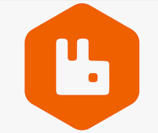
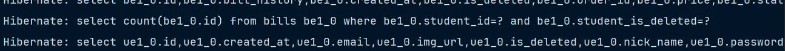
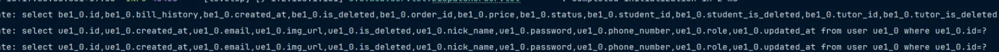
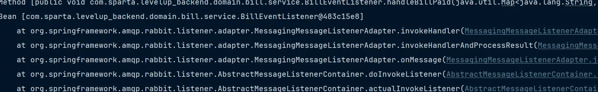

## 🎮 Level_UP - 원하는 멘토를 선택하고 실력을 키우는 게임 코칭 플랫폼! 🚀
<!---->

<br>
<!--
-->

## 목차
1. [프로젝트 소개](#1)
2. [팀원 소개](#2)
3. [주요 기능](#1)
4. [와이어프레임](#2)
5. [ERD]()
6. [아키텍처](#1)
7. [기능 설명](#2)
8. [트러블 슈팅]()

<br>


## 🚀 프로젝트 소개
### **🎮게임 장인들과 함께하는 실시간 피드백 & 재능 거래 플랫폼!**
게임을 더 잘하고 싶나요? 이제 게임 커뮤니티에서 각 장르의 장인들과 직접 소통하며 실시간 피드백을 받을 수 있습니다!

우리 플랫폼에서는 **고수들의 노하우를 실시간으로 전수받을 수 있는 거래 시스템**을 제공합니다. 원하는 게임의 장인을 찾아 직접 피드백을 받고, 스킬을 향상시켜 보세요.

**게임을 더 깊이 있게 즐기고, 성장하는 새로운 경험!** 지금 바로 커뮤니티에 참여해보세요.

개발 기간: 2025.02.10 ~ 2025.03.17

<br>

## 👤 팀원 소개

|                                         김효중                                          |                                        최대현                                        |                                                                  이경훈                                                                  |                                                                                         이동건                                                                                          |                                       정영균                                        |
  |:------------------------------------------------------------------------------------:|:---------------------------------------------------------------------------------:|:-------------------------------------------------------------------------------------------------------------------------------------:|:------------------------------------------------------------------------------------------------------------------------------------------------------------------------------------:|:--------------------------------------------------------------------------------:|
|  <a href="https://github.com/rlagywnd4" target="_blank"></a> | <a href="https://github.com/DeaHyun0911" target="_blank"></a> |<a href="https://github.com/kyung412820" target="_blank"> </a>                            |                                                  <a href="https://github.com/LeeDong-gun" target="_blank"> </a>                       |  <a href="https://github.com/lq0920084" target="_blank"></a> |
|                      [@rlagywnd4](https://github.com/rlagywnd4)                      |                  [@DeaHyun0911](https://github.com/DeaHyun0911)                   |                                            [@kyung412820](https://듯)   |                                                                    [@LeeDong-gun](https://github.com/LeeDong-gun)                                                                    |                    [@lq0920084](https://github.com/lq0920084)                    |
|                                  프로젝트 총괄 <br/> 커뮤니티                                  |                                      소켓, 배포                                       | ElasticSearch를 이용한 인기 검색어 조회 기능 <br />자동완성 <br />감성분석과 집계를 통한 Top3 선정 <br /> 클러스터를 이용한 분산 데이터 처리 <br /> 카테고리별 상품 개수 검색, ELK 기반 Log 관리 |             Order, Bill, Payments 테이블 관리 <br /> 결제흐름 구현 <br /> 재고관리(Redis 분산락, 비관적락) <br /> 중복결제 생성 개선(Redis Listener TTL발생) <br /> 결제승인 재시도 기능          |                                     스프링 시큐리티                                     |


<br>

## 💡 주요 기능

|       기능       | 내용                      |
|:--------------:|:------------------------|
|     소셜 로그인     | 구글, 네이버를 통한 소셜 로그인      |
|   상품 검색 서비스    | 이것 저것 여러 방식으로 상품 검색 가능  |
|     알림 서비스     | 회원 정보 변경시 알림이 가요        |
|     결제 서비스     | 상품 결제 쉽고 빠르고 편리하게 결제    |
|    커뮤니티 서비스    | 사용자들 끼리 글을 작성하고 조회가 가능  |
|      모니터링      | 로그 모니터링 가능~             |
|       채팅       | 사용자들끼리 채팅기능을 활용하고 소통 가능~ |

<br>

## 📝 **와이어프레임**


## 💬 **ERD**


## 🏆 **Architecture**


<br>

|  Level_UP Team Notion |  발표 보고서 |  발표 영상 |
|:------:|:----------------------:|:----------------------:|
| [Notion 보러가기](https://www.notion.so/teamsparta/9-1962dc3ef51480d5b934d27f143c3c41) | [발표 보고서 보러가기](https://www.canva.com/design/DAGaRbld9so/37ehM1xDZDsknpC-fXeebQ/edit?utm_content=DAGaRbld9so&utm_campaign=designshare&utm_medium=link2&utm_source=sharebutton) | [발표 영상 보러가기](https://www.youtube.com/watch?v=-8S3XLLW6jA) |

<br>

## 📚 **기술 스택**

### Frontend

<table>
  <tr>
    <td width="80px" height="60px">
      <a href="https://www.tcpschool.com/html/html5_intro_intro" target="_blank"></a>
    </td>
    <td width="80px" height="60px">
      <a href="https://www.w3schools.com/css/" target="_blank"></a>
    </td>

  </tr>
  <tr align='center'>
    <td>HTML5</td>
    <td>CSS3</td>
  </tr>
</table>

<br/>

### Backend

<table>
  <tr>
    <td width="80px" height="60px">
      <a href="https://www.java.com/" target="_blank"></a> 
    </td>
    <td width="80px" height="60px">
      <a href="https://docs.spring.io/spring-framework/docs/3.0.x/reference/expressions.html#:~:text=The%20Spring%20Expression%20Language%20(SpEL,and%20basic%20string%20templating%20functionality." target="_blank"></a>  
    </td>
    <td width="80px" height="60px">
      <a href="https://www.mysql.com/" target="_blank"></a>  
    </td>
    <td width="80px" height="60px">
      <a href="https://www.mongodb.com/" target="_blank"></a>
    </td>
    <td width="80px" height="60px">
      <a href="https://hibernate.org/" target="_blank"></a>
    </td>
  </tr>
  <tr align='center'>
    <td>Java</td>
    <td>Spring</td>
    <td>Mysql</td>
    <td>MongoDB</td>
    <td>Hibernate</td>
  </tr>
</table>

<table>
  <tr>
    <td width="80px" height="60px">
      <a href="https://redis.io/" target="_blank"></a>
    </td>
    <td width="80px" height="60px">
      <a href="https://https://spring.io/projects/spring-security" target="_blank"></a>
    </td>
    <td width="80px" height="60px">
      <a href="https://stomp-js.github.io/" target="_blank"></a>
    </td>
    <td width="80px" height="60px">
      <a href="https://stomp-js.github.io/" target="_blank"></a>
    </td>
   <td width="80px" height="60px">
      <a href="https://gradle.org/" target="_blank"></a>
    </td>
  </tr>
  <tr align='center'>
    <td>Redis</td>
    <td>Spring<br/>security</td>
    <td>Stomp</td>
    <td>Websocket</td>
    <td>Gradle</td>
  </tr>
</table>

<table>
  <tr>
    <td width="80px" height="60px">
      <a href="https://logback.qos.ch/" target="_blank"></a>
    </td>
   <td width="80px" height="60px">
      <a href="https://www.slf4j.org/" target="_blank"></a>
    </td>
    <td width="80px" height="60px">
      <a href="https://oauth.net/" target="_blank"></a>
    </td>
   <td width="80px" height="60px">
      <a href="http://www.jasypt.org/" target="_blank"></a>
    </td>
    <td width="80px" height="60px">
      <a href="https://www.rabbitmq.com/" target="_blank"></a>
    </td>
  </tr>
  <tr align='center'>
    <td>Logback</td>
    <td>Slf4j</td>
    <td>OAuth 2.0</td>
    <td>Jwt</td>
    <td>RabbitMQ</td>
  </tr>
</table>

<table>
  <tr>
    <td width="80px" height="60px">
      <a href="https://www.elastic.co/kr/" target="_blank"></a>
    </td>
   <td width="80px" height="60px">
      <a href="https://www.elastic.co/kr/kibana" target="_blank"></a>
    </td>
    <td width="80px" height="60px">
      <a href="https://www.elastic.co/kr/logstash" target="_blank"></a>
    </td>
  </tr>
  <tr align='center'>
    <td>elasticsearch</td>
    <td>kibana</td>
    <td>logstash</td>
  </tr>
</table>

<br/>

### DevOps

<table>
  <tr>
    <td width="80px" height="60px">
      <a href="https://aws.amazon.com/" target="_blank"></a> 
    </td>
    <td width="80px" height="60px">
      <a href="https://www.docker.com/" target="_blank"></a> 
    </td>
  </tr>
  <tr align='center'>
    <td>AWS</td>
    <td>Docker</td>
  </tr>
</table>

<br/>

### Tools

<table>
  <tr>
    <td width="80px" height="60px">
      <a href="https://www.notion.so/" target="_blank"></a>
    </td>
    <td width="80px" height="60px">
      <a href="https://github.com/" target="_blank"></a>
    </td>
    <td width="80px" height="60px">
      <a href="https://slack.com/intl/ko-kr" target="_blank"></a>  
    </td>
    <td width="80px" height="60px">
      <a href="https://github.com/features/actions" target="_blank"></a>  
    </td>
  </tr>
  <tr align='center'>
    <td>Notion</td>
    <td>Github</td>
    <td>Slack</td>
    <td>GithubActions</td>
  </tr>
</table>

<br/>

<div id="3"></div>

<br>

# 🎯 프로젝트 주요 기능

## 1. JWT 및 스프링 시큐리티 / OAuth 2.0 소셜 로그인
- JWT 및 Spring Security 설정을 통해 인증 및 인가 로직 구현
- OAuth 2.0을 사용하여 소셜 로그인 기능 구현

#### 주요 기능
- **일반 로그인**: email과 비밀번호를 통한 일반 로그인 기능
- **소셜 로그인**: 구글, 네이버 로그인을 통한 소셜 로그인 기능
- **자동 로그인**: 리프레시 토큰을 통한 자동 로그인 기능

#### 로그인 시스템 구성
- **Spring Security**: 스프링 시큐리티를 통한 로그인 시스템 기본 구성
- **JWT**: 액세스 토큰과 리프레시 토큰 발급을 위한 JWT
- **OAUTH2**: 소셜 로그인을 위한 OAUTH2 인증 시스템
- **MySQL**: 회원 정보 저장을 위한 RDB.

<br>

## 2. ElasticSearch를 활용한 검색 서비스

ElasticSearch는 대용량 데이터를 실시간으로 검색하고 분석할 수 있는 분산형 검색 엔진입니다.  
본 서비스에서는 ElasticSearch를 활용하여 **빠르고 정확한 검색 기능**을 제공합니다.

#### 주요 기능
- **키워드 검색**: 상품명, 게임 장르, 설명(Contents) 등을 기반으로 검색 가능
- **자동 완성(Auto-Suggest)**: 입력 중인 검색어에 대한 추천어 제공
- **필터링 및 정렬**: 가격, 인기순, 최신 등록일 등의 필터 및 정렬 기능
- **리뷰 감성 분석**: 검색 결과에 포함된 리뷰의 감성 점수를 분석하여 긍정적/부정적 리뷰 제공

#### 검색 성능 최적화
- **n-gram 토크나이저 적용**: 한국어 및 영어 검색을 위한 형태소 분석기 적용
- **검색 인덱스 튜닝**: 불필요한 필드 제외 및 검색 성능 향상을 위한 캐싱 적용
- **ElasticSearch Query DSL 활용**: 다중 필드 검색 및 적용

<br>

## 3. 모니터링 서비스

서비스의 원활한 운영을 위해 **실시간 모니터링 시스템**을 구축하여 장애 예방 및 성능 개선을 지원합니다.

#### 주요 모니터링 항목
- **로그 모니터링(Log Monitoring)**: Logstash & Filebeat를 활용하여 서버 및 애플리케이션 로그 수집
- **모니터링 시각화**: Kibana를 활용한 시스템 로그, 데이터 관리 시각화
- **ElasticSearch 검색 성능 모니터링**: 검색 응답 시간 및 인덱스 크기 모니터링

#### 모니터링 시스템 구성
- **Elastic Stack(ELK)**: Elasticsearch + Logstash + Kibana를 이용한 로그 분석
- **Fleet Server**: 서버 및 애플리케이션 성능 시각화

<br>

## 4.알림 서비스

- 회원가입 완료시 회원가입 환영메시지가 가입 이메일을 통해 발송.
- 회원정보 변경감지시 로그인된 사용자에게 알림이 가도록 구현.

#### 알림 서비스 시스템 구성

- **Server Sent Event(SSE)**: 클라이언트와 서버의 연결 유지를 위한 표준 기술. 단방향 통신
- **Spring Event**: 알업의 속도에 영향을 미치지 않게 하기 위한 스프링 이벤트
- **Redis**: SSE 연결 끊김 발생시 수신 성공한 메시지부터 다시 받아오기 림을 변경 작업과 별개의 스레드로 동작시켜 변경 작위한 임시 보관용 Redis 캐시
- **MySQL**: 변경메시지와 타겟 유저, 변경시각, 알림 전송 성공 여부를 기록하기 위한 추가 RDB. 관리자만 접근가능.

<br>

## 5. 결제 서비스

### 주요기능
- **간편신속 결제** : 카드, 간편결제, 계좌이체 토스페이 지원
- **안전하고 신속한연동** : 토스 개발자 문서를 활용하여 빠르게API 연동 가능
- **가상 테스트** : 실 결제 없이 테스트 가능
- **알림 서비스** : 결제 관련 알림 전송
- **환불 서비스** : 결제 취소 및 환불기능 지원
- **편리한 승인** : 결제 승인 실패 시 재시도 전략 적용
- **정합성** : 안정적인 주문 처리 
- **악질유저 방지** : 재고 관리에 대한 악성유저 방지
## 결제서비스 시스템 구성
- **Redis Listener** :Redis TTL발생 10분이내 결제되지않으면 HardDelete, 유저간 결제 관련 알림
- **TossPayments API** : 토스페이먼츠 외부 API를 호출 하여 승인 및 취소

## 6. 커뮤니티 서비스
사용자들이 자유롭게 게시글을 작성하고, 타인의 게시글을 조회하는 기능
- Redis에 저장된 데이터를 스프링 부트에서 조회 및 관리하기 위해 RedisTemplate을 활용 
- Redis의 Sorted Set을 활용하여 조회수를 저장 -> 글 검색시 조회수가 높은 순서대로 응답


<br>

# 🔧 **성능 개선**

## 1. **레디스 캐싱**: 데이터 캐싱을 통한 빠른 응답 처리

**캐시 미적용**


**캐시 적용**


|        | **평균 응답속도** |
|--------|-------------|
| 캐시 미적용 | 5초 91ms     |
| 캐시 적용  | 1초 880ms    |

- **최적화 결과**
    - Redis Cache 적용 후 **평균 응답 속도 3초 211ms 향상** ㅇ

<br>
<br>

## 2. **Elasticsearch**: 엘라스틱 서치를 이용한 검색 속도 개선


| **검색 방법**                  | **설명**                         | **실행 속도 (ms)** |
  |--------------------------------|--------------------------------|-------------------|
| `getPopularKeywords()`         | 기본적인 검색어 집계            | **39ms**          |
| `getPopularKeywordsOptimized()` | 실행 힌트 적용 (`Map` 방식)     | **33ms**          |
| `getPopularKeywordsFastest()`   | 실행 힌트 + 쿼리 캐싱 적용      | **17ms**          |

- **최적화 결과**
    - 기본 검색 대비 **최대 2.3배 속도 향상**
    - `executionHint(TermsAggregationExecutionHint.Map)` 적용 시 **15% 속도 개선**
    - `requestCache(true)` 적용 후 **50% 추가 속도 개선**
    - 캐싱된 검색어 데이터를 활용하면 **0.1초 이내** 응답 가능

<br>
<br>

## 3. **Redis TTL** : 주문 후 10 분 결제 누락 시 악성재고관리 방지


위 상황은 주문을 만들었지만 결제를 진행하지않고 PENDDING 상태로 유지중.

주문 생성이 되면 재고 감소가 이루어진상황.

### 1. **개요**
주문이 생성되었으나 결제가 진행되지 않으면 PENDING 상태로 유지됨.
이때 재고 감소는 이미 적용된 상태.
결제 없이 일정 시간이 지나면 주문을 자동 삭제하여 악성 재고를 방지.
### 2. Redis TTL 적용 방식
TTL 설정
주문이 생성되면 Redis에 TTL(10분) 설정.
TTL이 설정된 주문은 10분 내 상태 변경이 없으면 자동 삭제.
Redis Listener 활용
TTL이 만료되면 삭제 이벤트를 감지하여 로그 기록.
주문 삭제 시 재고를 원상 복구하여 악성 재고 방지.


- Redis Listener 활용
- 재고 감소가 이루어질 부분 분산락 적용
- TTL을 발생 시킨 후 만료되어 삭제 될때 로깅
  
  TTL 발생을 로직으로 적용시켜 발생하면 레디스에 TTL데이터가 생성이됩니다.
  10분 이내로 상태 변경이 일어나면 TTL은 삭제 되고 변경이 되지않는다면
  생성 되었던 Order는 HardDelete가 이루어집니다.

<br>
<br>

### 4.

<br>

<br>

### 5.

<br>
<br>

# 🔒 **트러블슈팅**

## 1. **엘라스틱 서치의 사용 이유**
- Mysql로 기존의 30만 이상의 데이터에서 특정 단어가 포함된 데이터를 조회시 속도가 조금 느리다는 판단을 함(4.932초)
  
-  속도의 개선을 위해서 캐시를 적용하거나 페이징을 통해 카테고리화를 수행하여 속도를 올려봄
-  **속도를 개선하다보니 많은 현업의 몇 천만 데이터를 관리하기 위해서는 새로운 해답이 필요하다 생각하게 됨**
-  레디스를 찾다가 엘라스틱 서치라는 것을 알게되어 적용 시작
-  **Mysql과 다른 역인덱스 구조가 검색의 속도를 비약적으로 빠르게 해준다는 것을 학습**, 적용함
-  Mysql에서 일부를 처시할 경우 5초가 걸렸지만 엘라스틱 서치의 힌트와 캐시를 적용한 후엔 0.2초가 걸리게 바뀜
-  최종적으로 엘라스틱 서치를 적용하여 검색 속도를 향상
-  (다만, mysql도 인덱싱을 잘한 상태라면 적은 데이터 셋에서는 엘라스틱 서치보다 빠를 수 있어, 적재적소에 사용해야한다는 것을 유념)
   

<br>

## 2. CustomOAuth2UserService에서 발생한 Exception이 상위로 던져지지 않는 문제

- CustomOAuth2UserService에서 발생한 로그인 실패 관련 커스텀 Exception들이 상위로 넘어가지 못해서 postman과 웹페이지로 표시가 되지 않는 문제가 발생하였다.
  
- 어떤 이유로 로그인에 실패했는지 명확하게 사용자에게 알려주기 위해서는 반드시 이 커스텀 Exception이 상위로 던져져야만 한다.
- 이 문제를 해결하기 위해 **어디에서 넘어가지 못했는지 알아보다가 **OAuth2LoginAuthenticationFilter**에서는 OAuth2AuthenticationException만 상위로 넘겨줄 수 있다는 것을 알게 되었다.**
- OAuth2AuthenticationException에 메시지부분에 발생한 Exception의 메시지를 넣어주고, Exception을 받는 핸들러부분에서 메시지를 꺼내 리턴해주면 해결될것이라 판단하였다.
- 해당 방식으로 구조를 변경한 후 정상적으로 익셉션이 상위로 리턴됨을 확인하였다.
  

<br>

## 3. PageableExecutionUtils를 활용한  count쿼리 최적화

### 문제 상황

프로젝트에서 페이지네이션을 적용하기 위해 `PageImpl`을 사용하고 있었다. 하지만 `PageImpl`을 사용하면 기본적으로 전체 데이터 개수를 구하기 위해 count쿼리가 실행되는데. 이로 인해 성능 저하가 발생했다.
예를 들어, 한 페이지에 10개의 데이터를 불러올 때, 총 21개의 데이터가 있다면 아래와 같은 방식으로 쿼리가 실행 되었다.

- **데이터 조회 쿼리 :** `SELECT * FROM bill WHERE ... LIMIT 10 OFFSET 0`
- **카운트 쿼리 :** `SELECT count(*) FROM bill WHERE …`

불필요한 count 쿼리가 매번 실행되면서 성능 저하가 발생했다.



### 문제 원인

- `PageImpl`을 사용할 경우, 기본적으로 전체 데이터 개수를 가져오기 위해 count 쿼리를 실행한다.
- 일부 경우에는 정확한 총 개수를 알 필요 없이, 다음 페이지가 존재하는지만 확인하면된다.
- count쿼리가 실행 될 경우, 데이터가 많아질수록 성능 저하가 발생할 가능성이 높다.

### 해결 방법

`PageableExecutionUtils.getPage()` 를 활용하여 count 쿼리를 최적화 하였다.

**기존코드 (`PageImpl` 사용)**
```
JPAQuery<Long> totalCount = queryFactory
.select(billEntity.count())
.from(billEntity)
.where(
billEntity.tutor.id.eq(tutorId),
billEntity.tutor.isDeleted.eq(false)
);

return new PageImpl<>(results, pageable, totalCount.fetchOne());
```

- `totalCount.fetchOne()`를 통해 count쿼리를 직접 실행함 → 성능 저하 발생.

**수정 코드 (`PageableExecutionUtils` 적용)**
```
JPAQuery<Long> totalCount = queryFactory
    .select(billEntity.count())
    .from(billEntity)
    .where(
        billEntity.tutor.id.eq(tutorId),
        billEntity.tutor.isDeleted.eq(false)
    );

return PageableExecutionUtils.getPage(results, pageable, totalCount::fetchOne);
```

- `PageableExcutionUtils.getPage()`를 사용하여 count 쿼리 실행을 지연
- 필요할 때만 count쿼리가 실행 되므로 불필요한 성능 저하 방지

### 결과 및 효과

- **Count 쿼리 제거** : `PageableExcutionUtils.getPage()` 를 적용한 후, Count쿼리가 실행되지 않음.

- **성능 개선** : 불필요한 쿼리 제거로 페이지네이션의 성능이 향상됨.
- **데이터 개수 최적화** : 21개의 데이터가 있을 경우 10+10+1개가 아닌, 10+ 10개만 불러오도록 개선됨.

### 결론

`PageableExcutionUtils.getPage()` 를 활용하여 count쿼리 실생을 줄이면 성능을 최적화할 수 있다. 특히, 전체개수를 정확히 알 필요가 없는 경우에는 count 쿼리를 지연 실행하거나 생략하는 것이 성능 개선에 큰 도움이 된다.

<br>

## 4. RabbitMQ 메세지 변환 오류 트러블슈팅
### 문제 상황

- 기존 Redis pub/sub 방식에서 RabbitMQ로 변경하면서 메세지 유실 문제 발생
- RabbitMQ에서 Long 타입 메세지를 전송했지만, 리스너에서 `Map<String, Object>` 타입으로 받아 변환 과정에서 오류 발생

### 기존코드
```
public void handleBillPaid(Map<String, Object> message)
```
- `Map<String, Object>` 형태로 메세지를 받아 처리
- JSON 변환 과정에서 `ClassCastException` 발생 가능

### 해결 방법

1. **DTO 사용하여 명확한 데이터 구조 정의
   기존** `Map<String, Object>` 대신, DTO 클래스를 생성하여 메시지를 받을 수 있도록 변경
2. **MessageConverter 설정 추가**
   RabbitMQ 설정 파일에서 Jackson 기반, JSON 변환을 위한 `messageConverter`등록
```
@Bean
public MessageConverter messageConverter() {
    return new Jackson2JsonMessageConverter();
}
```
3. 리스너에서 @Payload 사용하여 DTO 맵팽
RabbitMQ 리스너 메서드에서 `@Payload`를 활용해 JSON 데이터를 DTO로 직접 변환
```
@RabbitListener(queues = "bill.paid.queue")
public void handleBillPaid(@Payload PubBillDto dto) {
  
}
```
### 기존코드 (`PageImpl` 사용)
```
JPAQuery<Long> totalCount = queryFactory
    .select(billEntity.count())
    .from(billEntity)
    .where(
        billEntity.tutor.id.eq(tutorId),
        billEntity.tutor.isDeleted.eq(false)
    );

return new PageImpl<>(results, pageable, totalCount.fetchOne());
```
- `totalCount.fetchOne()`를 통해 count쿼리를 직접 실행함 → 성능 저하 발생.
### 개선된 코드
```
public void publishBillStatusChange(BillEntity bill) {
    String routingKey = getRoutingKey(bill.getStatus());

    PubBillDto billDto = new PubBillDto();
    billDto.setBillId(bill.getId());
    billDto.setTutorId(bill.getTutorId());
    billDto.setStudentId(bill.getStudentId());
    billDto.setStatus(bill.getStatus());

    log.info("변경된 bill 상태: {}", billDto);
    rabbitTemplate.convertAndSend(exchange, routingKey, billDto);
}
```
- `Map<String, Object>` 가 아닌 `pubBillDto` 객체를 RabbitMQ로 전송
- `Jackson2JsonMessageConverter` 를 사용하여 DTO를 JSON으로 변환

### 결론

- DTO 사용으로 데이터 구조 명확화
- JSON 변환 오류 방지
- RabbitMQ 메세지 처리 안전성 증가

메세지를 더 구조적으로 관리할 수 있고, 데이터 변환 과정에서 발생하는 오류를 줄일 수 있음.
<br>

## 5. 오류, 성공 메시지 통합 컨벤션 적용 도중 필터 오류메시지 컨벤션 적용 불가 문제 트러블 슈팅
### 문제 상황

- 필터영역에서 발생한 오류메시지는 GlobalExceptionHandler가 오류를 캐치하는 DispatcherServlet을 통과하기 전 단계이기 때문에 GlobalExceptionHandler에서 이 오류를 처리해줄 수 없음.

### 스프링 MVC 필터에서 메시지 컨벤션 해결 방법

1. 기존 오류 메시지, 성공 메시지 컨벤션과 완전하게 동일한 형태의 오류 메시지와 성공 메시지를 String값으로 선언한 필터리스폰 클래스 생성.
2. 발생한 오류 메시지와 성공 메시지를 해당 클래스를 통해 직접 HttpServletResponse의 getWriter메소드의 write로 메시지를 HttpServletResponse에 작성.
3. 해당 HttpServletResponse 객체를 리턴하는 것으로 동일한 컨벤션을 지키는 오류 메시지, 성공 메시지를 그대로 출력 가능.

### 스프링 클라우드 API 게이트웨이에서 메시지 컨벤션 해결 방법

1. 기존 오류 메시지, 성공 메시지 컨벤션과 완전하게 동일한 형태의 오류 메시지와 성공 메시지를 Map 형태로 선언한 필터리스폰 클래스 생성.
2. 발생한 오류 메시지와 성공 메시지를 해당 클래스를 통해 ByteStream으로 변환한 뒤, DataStream으로 감싸고, Mono로 한번 더 감싸서 반환.
3. 반환된 Mono를 게이트웨이 필터를 통해 리턴하는 것으로 동일한 컨벤션을 지키는 오류 메시지, 성공 메시지를 그대로 출력 가능.

### 두 스프링 필터에서 리턴방식에 차이가 발생한 이유
- 스프링 MVC는 블로킹 방식의 구조를 가지고 있어 단 한 개의 스레드에서 오류가 발생하면 다른 작업이 진행되는 일 없이 바로 리턴되지만, 스프링 클라우드 API 게이트웨이는 논블로킹 방식의 WebFlux를 사용하고 있어서 오류가 발생해도 다른 필터의 검증 작업은 그대로 진행되기 때문에, 모든 필터가 검증이 끝난 뒤에 오류를 리턴하는 pub, sub 구조를 채택하고 있기 때문에 Mono 와 DataStream을 사용해 논블로킹 방식을 유지하며, 오류를 리턴하는 방식을 사용한다.

### 결론
- 발생한 오류가 어느 위치에서 발생하는지, 사용하는 프레임워크가 어떤 처리방식을 채택했는지에 따라, 메시지 컨벤션 방법이 크게 달라질 수 있다.
- 그러므로, 어느 위치에서 리턴되는지 파악하는 것은 매우 중요하다.

# 📈 **추가 개선 가능 점**

## 1.  **엘라스틱 서치 개발의 개선**
- 샤드 수가 너무 많으면 오버헤드가 증가하고, 너무 적으면 데이터 검색 속도가 저하된다. 이를 유념하여 조정이 필요하다.
- 데이터의 사용 빈도에 따라 핫(Hot), 웜(Warm), 콜드(Cold) 노드를 구성하여 리소스를 효율적으로 사용해야한다.
- 여러 클러스터로 나누어 데이터를 검색하거나 복자하여 대규모 환경에서도 안정적인 성능을 유지할 수 있도록 개발해야한다.
- 백업을 위한 스냅샷을 정기적으로 생성하도록 설정해야한다.

<br>

## 2. 알림 이메일 발송기능
- 기존에는 알림을 로그인된 사용자에게만 발생했으나, 해킹을 당해 적법한 사용자의 허가 없이 개인정보 변경작업이 일어나는 경우에 로그인이 되어있지 않은 사용자는 이 상황을 인지할 수 없는 문제가 있다는 것이 확인되어 개인정보 변경시에 사용자에게 알림을 보내주어, 사용자가 해킹을 당한 상태라는 것을 인지할 수 있게 만들어야 한다.
  <br>

### 3.

<br>

### 4. 

